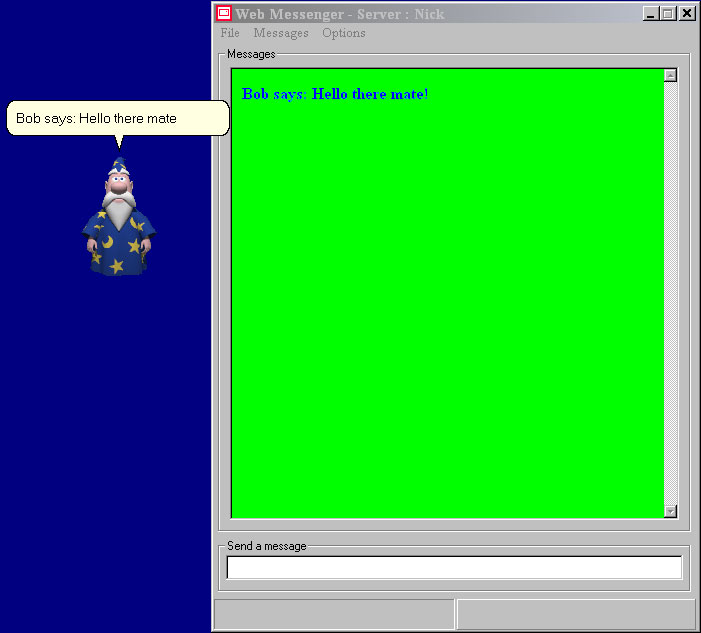



## WEB MESSENGER 3 \*\*\*UPDATED AGAIN\*\*\*

### Description

I THINK THAT I HAVE FIXED ALL THE BUGS, THOUGH WITH THE AMMOUNT OF DATA FLOATING AROUND IN THIS PROGRAM ITS HARD TO TELL. IF YOU HAVENT READ THE OTHER 2 SUBMISSIONS THEN THIS IS AN INSTANT MESSAGING APPLICATION FOR PEER TO PEER CHATTING. YOU CAN CHANGE THE MESSAGE COLOURS, SOUND EVENTS AND BUDDIE LIST, AND ALSO HAVE STRINGS REPLACED BY PICTURES, JUST LIKE IN MSN MESSENGER. THE BUDDIE LIST ALSO ALLOWS YOU TO APPLY MSAGENTS TO INDIVIDUALS AND WHEN YOU CONNECT THE RELEVENT AGENT WILL WALK ONTO THE SCREEN AND SPEAK THE RECIEVED MESSAGES, I HAVE HAD LOTS OF DIFFICULTY WITH THE BUDDY LIST SO PLEASE HAVE PATIENCE.

PLEASE GET IT, RATE IT AND COMMENT ON IT!!

PLEASE!!!

NICK :)
 
### More Info
 

             |
---                |---
**Submitted On**   |2001-02-18 20:46:06
**By**             |[Niknak\!\! \<OLD\>](https://github.com/Planet-Source-Code/PSCIndex/blob/master/ByAuthor/niknak-old.md)
**Level**          |Advanced
**User Rating**    |4.6 (37 globes from 8 users)
**Compatibility**  |VB 6\.0
**Category**       |[Complete Applications](https://github.com/Planet-Source-Code/PSCIndex/blob/master/ByCategory/complete-applications__1-27.md)
**World**          |[Visual Basic](https://github.com/Planet-Source-Code/PSCIndex/blob/master/ByWorld/visual-basic.md)
**Archive File**   |[CODE\_UPLOAD151612182001\.zip](https://github.com/Planet-Source-Code/niknak-old-web-messenger-3-updated-again__1-21128/archive/master.zip)

